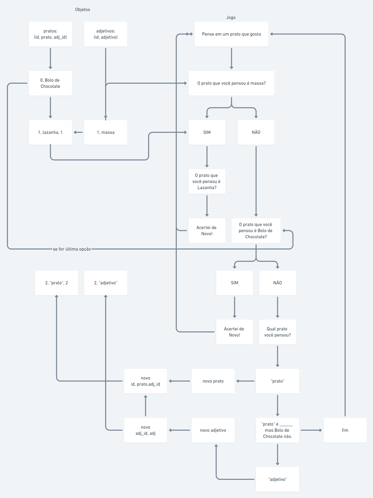

# Gourmet Game
Gourmet Game - The Classic job test in Functional Code/NodeJS

# Start

To start the game, just open the "index.js" with Node 8+

```bash
node index.js
```

And Have fun :)

# The Road:

* Plan with a flowchart the general algorythm.
    
* Plan operator and methods for the algorythms.
    
* Do the plans
    
* Fix bugs
  


# Algorythm Flowchart:



----
## Made with <3 by **Savio Castelo**.
